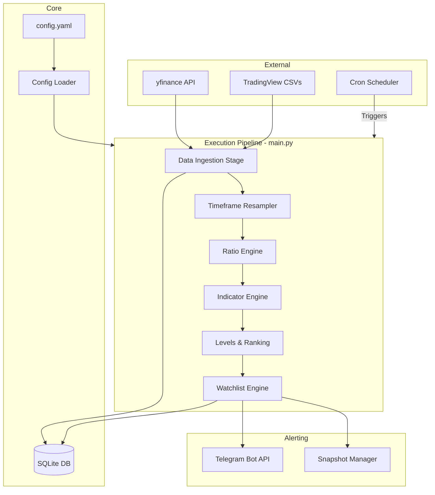
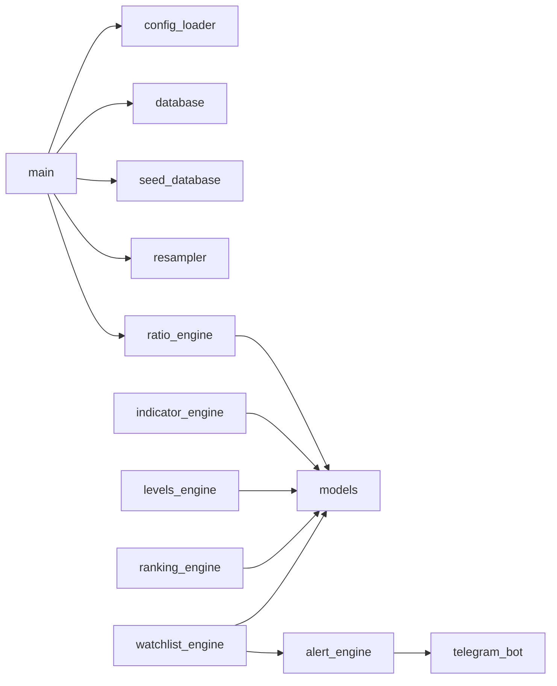

# System Architecture and Engineering Design

This document outlines the architectural decisions, system design, and engineering tradeoffs made in building the AlphaRatio Scanner. It is intended for software engineers, quantitative developers, and open-source contributors looking to understand the system's inner workings.

---

## 1. System Architecture

The scanner operates as a modular, linear data pipeline executed periodically (e.g., daily via `cron`). The architecture strictly separates data ingestion, business logic (engines), persistence, and presentation (alerts).

### 1.1 High-Level Architecture Diagram

---

## 2. Data Flow

1. **Configuration Sync**: On initialization, `main.py` reads `config.yaml`, ensuring all tracked symbols and benchmarks exist in the SQLite database.
2. **Ingestion & Validation**: The pipeline queries the DB for missing dates and fetches the delta from Yahoo Finance (`yfinance`). 
   - *Smart History Fetching*: To ensure new symbols added to `config.yaml` are immediately functional, the system checks the database for existing records. If fewer than 60 records exist, it triggers a `period="max"` fetch; otherwise, it performs an incremental `5d` update.
   - *Smart Invalidation*: If a corporate action (like a split) changes historical Adjusted Close prices, the system detects the divergence and automatically triggers a historical backfill to maintain data integrity.
   - *Manual Ingestion Fallback*: For assets restricted by third-party APIs (e.g., secondary indices on Yahoo Finance), the system supports manual OHLCV ingestion via CSV. This workflow integrates with the configuration layer, automatically syncing database records if the symbol is present in `config.yaml` but missing from the schema.
3. **Resampling**: Daily Open-High-Low-Close-Volume (OHLCV) data is resampled into Weekly and Monthly data frames using Pandas.
4. **Vectorized Computation**: 
   - **Ratio Engine**: Divides asset OHLC by benchmark OHLC.
   - **Indicator Engine**: Applies RSI, EMA, and Volatility bands to the *ratio data* (not just absolute price).
   - **Levels Engine**: Calculates Rolling 52-week Highs and All-Time Highs (ATH).
5. **Ranking**: Cross-sectional percentiles are calculated (e.g., Rank 99 means the asset is outperforming 99% of the universe).
6. **State Evaluation**: The Watchlist Engine compares new rankings against historical states to detect transitions (Entry/Exit).
7. **Dispatch**: State changes are dispatched to Telegram.

---

## 3. Engineering Decisions & Tradeoffs

### 3.1 Why SQLite?
**Decision**: We use SQLite via SQLAlchemy rather than PostgreSQL or a specialized time-series database (like InfluxDB or QuestDB).
**Tradeoff**: 
- *Pros*: Zero setup, zero networking overhead, single file portability, and ACID compliance. Ideal for a CLI/Cron-first tool.
- *Cons*: Poor write concurrency. 
- *Justification*: For EOD (End of Day) data across a few thousand symbols, the entire dataset fits easily into RAM, and writes are batched linearly during the daily run. A time-series DB would be overkill and complicate the developer experience.

### 3.2 Why YAML for Configuration?
**Decision**: System states, symbols, and parameters are driven by a single `config.yaml`.
**Tradeoff**:
- *Pros*: Highly readable, supports comments, allows traders to manage lists without touching Python code.
- *Cons*: Lacks strict typing compared to a GUI or JSON Schema.
- *Justification*: Traders are accustomed to config files. We mitigate YAML's downsides by using Pydantic (planned) or strict dict validation at startup to fail fast on malformed configs.

### 3.3 Synchronous vs. Asynchronous Execution
**Decision**: The computation pipeline is purely synchronous, while network dispatch (Telegram) is `async`.
**Tradeoff**:
- *Justification*: Pandas operations release the GIL for heavy C-level vectorization, but Pandas itself is not async-friendly. Therefore, multi-threading/async during the CPU-bound calculation phase adds overhead without benefit. We use `asyncio` strictly for I/O bound network alerts at the end of the pipeline.

### 3.4 Handling Lookahead Bias
**Decision**: Indicators and rankings are strictly calculated on *Close* prices, and alerts are dispatched *after* market close.
**Justification**: To maintain quant-grade reliability, the `Resampler` strictly groups by standard calendar weeks/months, and forward-filling (`ffill`) is heavily restricted to avoid data leakage from future dates into historical backtests.

---

## 4. Module Dependency Graph

---

## 5. Error Handling Philosophy

We adhere to a **"Fail Fast, Alert Loudly, Recover Gracefully"** philosophy:
1. **Critical Ingestion Failures**: If benchmark data fails to download (e.g., NIFTY50), the entire pipeline halts, and an error is pushed to Telegram. We cannot calculate relative strength without the denominator.
2. **Partial Ingestion Failures**: If an individual asset fails to download, the pipeline logs a warning, skips the asset, and processes the rest of the universe.
3. **Database Locks**: Addressed via batch transactions (`Session.bulk_save_objects`) and connection pooling parameters tailored for SQLite (`timeout=30`).

---

## 6. Future Architecture: Scalability & Distributed Processing

While currently optimized for a solo developer/trader on a single VPS, the architecture is designed to scale:

1. **Dashboard / API Layer (Planned)**:
   - Introducing `FastAPI` to serve DB states.
   - Moving from SQLite to `PostgreSQL` for concurrent Read/Write capabilities.
2. **Message Queues (Planned)**:
   - Migrating from linear batch processing to a worker model using `Celery` or `RQ` (Redis Queue) to handle Intraday (1m/5m/15m) data fetching and concurrent ratio computations.
3. **Plugin Architecture**:
   - Refactoring the engines into an abstract `BaseScanner` interface, allowing open-source contributors to drop a new `.py` file into a `plugins/` directory to automatically register new technical indicators.
