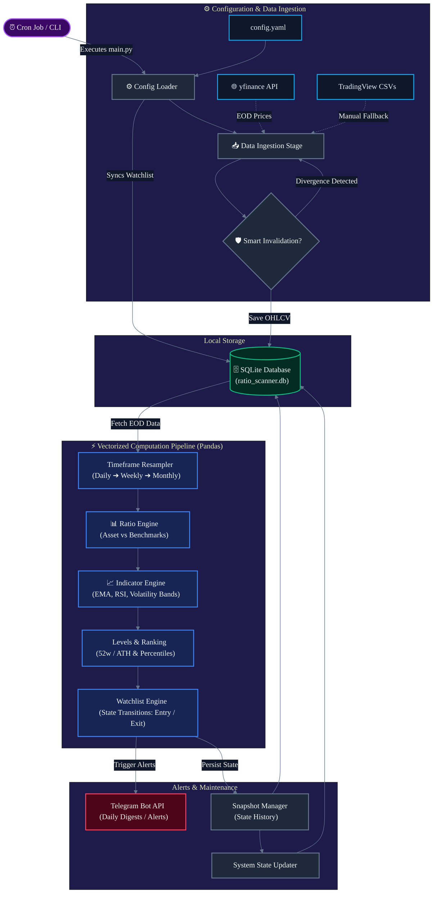

# AlphaRatio Scanner 📈

[](https://www.python.org/downloads/)
[](https://github.com/astral-sh/ruff)
[](https://opensource.org/licenses/Apache-2.0)
[](https://github.com/coderkrp/ratio-scanner/actions)
[](#)

A high-performance, Python-based relative strength and momentum scanning platform for Indian Equities (NSE). AlphaRatio Scanner automates the workflow of identifying market leadership, sector rotation, and momentum breakouts through multi-timeframe ratio analysis against dynamic benchmarks.

---

## 📖 Project Overview

AlphaRatio Scanner was built to eliminate the manual toil in quantitative momentum and relative strength trading. It takes end-of-day (EOD) market data, computes ratio-adjusted performance against major indices (e.g., Nifty 50, Nifty Midcap), and alerts the user to emerging market leaders via Telegram.

### Why Ratio Analysis?
In momentum trading, absolute price action can be misleading during broad market corrections. By dividing a stock's price by a benchmark index (e.g., `RELIANCE / NIFTY50`), we isolate the **relative performance**. This scanner mathematically tracks these ratios to identify assets that are ignoring market weakness or leading market rallies.

---

## ✨ Features

* **Multi-Benchmark Ratio Analysis**: Compare single assets against multiple benchmarks simultaneously (e.g., compare a bank stock against both Nifty 50 and Nifty Bank).
* **Multi-Timeframe Aggregation**: Automated resampling for Daily, Weekly, and Monthly analysis to align with different trading strategies.
* **Quant-Grade Metrics**:
  * `rs_strength_pct`: Proximity to 52-week relative highs.
  * `distance_to_ath_pct`: Precision tracking for All-Time High breakouts.
* **Config-Driven Architecture**: Easily add symbols, define custom benchmarks, and tweak scanner logic via YAML. No code changes required.
* **Telegram-First Ops**: Daily digests, entry/exit signals with built-in hysteresis to avoid whipsaws, sent directly to your phone.
* **Data Resilience**: Automated detection of corporate actions (splits, bonuses) and robust CSV import tools to backfill TradingView data.

---

## 🏗 Architecture Overview

AlphaRatio Scanner is designed as a modular, stateless pipeline executed via cron. 
For a deep dive into the system design, data flow, and design trade-offs, see our [Architecture Documentation](ARCHITECTURE.md).



---

## 🚀 Quick Start

### 1. Prerequisites
- **Python 3.12+**
- `uv` (recommended) or `pip`
- A Telegram Bot Token & Chat ID ([Guide](docs/setup.md#telegram-setup))

### 2. Installation
```bash
git clone https://github.com/coderkrp/ratio-scanner.git
cd ratio-scanner

# Create virtual env and install
uv venv --python 3.12
uv pip install -r requirements.txt
```

### 3. Configuration
Copy the configuration template and add your credentials and stock watchlists.
```bash
cp config.example.yaml config.yaml
```
*See [Configuration Guide](docs/configuration.md) for advanced setup.*

### 4. Initialization
Seed the historical database (SQLite):
```bash
export PYTHONPATH=.
uv run scripts/seed_database.py
```

### 5. Run the Pipeline
Execute the daily pipeline (ideally scheduled via cron after market close):
```bash
uv run main.py
```

---

## 📊 Example Outputs

### Telegram Daily Digest
```text
📈 AlphaRatio Daily Digest - 18 May 2026

🌟 NEW LEADERS (Crossed 95% RS Threshold):
- CLEAN.NS (vs NIFTY50): RS=96.2%, Dist2ATH=-2.1%
- TRENT.NS (vs NIFTY50): RS=99.1%, Dist2ATH=-0.5%

📉 DROPPING OFF (Fell below 80% RS):
- HDFCBANK.NS: RS=72.4% (Exiting Watchlist)
```

---

## ⚡ Performance Notes

- **Vectorized Computation**: Heavy lifting for ratio computation and indicator math is handled natively via `pandas` and `pandas-ta`, avoiding slow `for` loops.
- **Lightweight Storage**: SQLite is used with SQLAlchemy for low-overhead, local-first storage suitable for up to ~2,000 symbols over 10 years of daily data.
- **Smart Invalidation**: The pipeline only fetches new data and recalculates necessary intervals, keeping daily execution times under 30 seconds for 500+ symbols.

---

## 🗺 Roadmap

See [ROADMAP.md](ROADMAP.md) for upcoming features including:
- Web-based Dashboard (FastAPI + React)
- Websocket Streaming for Intraday Scans
- Extensible Plugin Architecture for Custom Indicators

---

## 🤝 Contributing

We welcome contributions from quant enthusiasts and software engineers! 
Please review our [Contributing Guidelines](CONTRIBUTING.md) and [Code of Conduct](CODE_OF_CONDUCT.md).

---

## ⚖️ Disclaimer

**Educational and Informational Purposes Only.**
The data and alerts generated by AlphaRatio Scanner do not constitute financial advice. Algorithmic trading involves significant risk. Always backtest your strategies and consult with a certified financial advisor before committing capital.

---

## 📄 License

This project is licensed under the [Apache 2.0 License](LICENSE).
